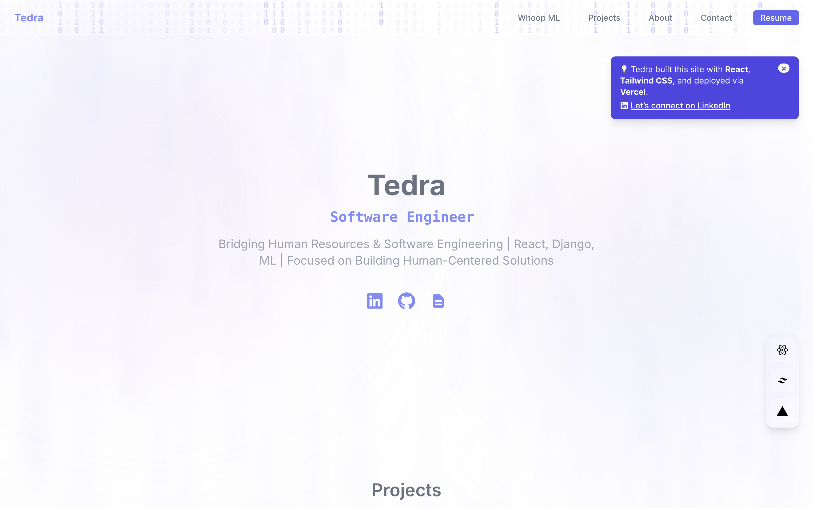

# 🌌 Tedra — Personal Portfolio Website

Welcome to my personal portfolio website! This frontend project is built to showcase my skills as a full-stack developer and machine learning enthusiast, with a creative UI and backend django integrations.

This site reflects my passion for tech, storytelling through software, and solving real problems. Thanks for visiting!

## 🔮 Features

- 🧠 **Matrix Background Animation** — Unique animated canvas backdrop for a cyber-inspired aesthetic.
- ✍️ **Typewriter Introduction** — Dynamic title rotating through roles like *ML Enthusiast*, *Software Engineer*, etc.
- 📂 **Interactive Projects Carousel** — Smooth scroll-snap carousel of my top projects with GitHub and Live Demo links.
- 📄 **Interactive Resume Preview** — Quick resume preview on hover for recruiters and visitors.
- 🌐 **Navigation Anchors** — Clean navbar linking to `Projects`, `About`, and `Contact` sections.
- 📉 **Mini Analytics** — Light stats component to show GitHub or other metrics.
- 💬 **Toast Notification Component** — Reusable toast alerts system.
- 🎯 **Tech Badges** — Frontend and backend technologies shown visually under the hero section.
- 📱 **Fully Responsive** — Optimized for desktop and mobile.

## 🧰 Built With

- **React.js** — Frontend UI
- **Django** — Backend
- **Tailwind CSS** — Styling and layout
- **Framer Motion** — Smooth transitions and animations
- **React Simple Typewriter** — Typewriter intro text
- **React Icons** — GitHub, LinkedIn, and document icons
- **Custom Canvas** — Matrix-style background animation

## 🚧 Upcoming Backend Integration
## 💡 Future Enhancements

- ✅ Contact form with email backend via Django
- ⏳ Blog section with Markdown support or CMS integration
- 🔐 Admin login to manage featured projects dynamically
- 🧠 ML-powered project recommender
- 🧩 Connect Django backend to serve projects via REST API

## 🚀 Deployment

## 🛠️ Built With

- **Frontend:** React.js + Vite + Tailwind CSS
- **UI/UX:** Custom animations, glassmorphism, typewriter
- **Icons:** React-Icons
- **Extras:** `react-simple-typewriter`, responsive layout
Site deployed via **Netlify**, connected to GitHub for continuous deployment.

## 📁 Project Structure

frontend/
├── public/
│ └── screenshots/
├── src/
│ ├── components/
│ ├── pages/
│ ├── styles/
│ ├── App.jsx
│ ├── main.jsx
├── tailwind.config.js
├── vite.config.js
├── package.json
└── README.md